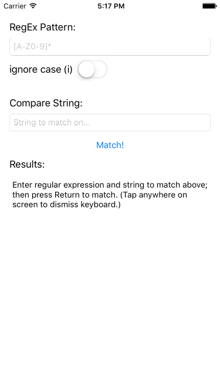
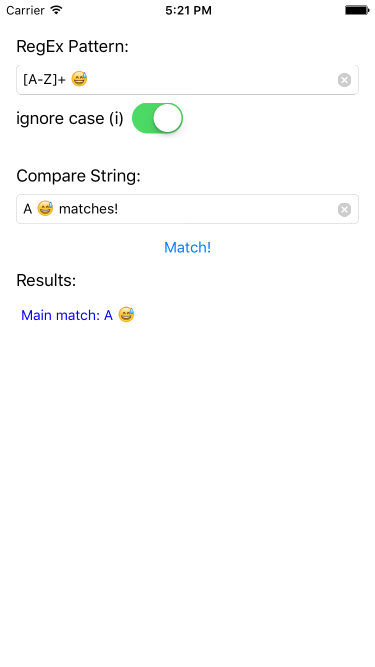

## RegExTester

### *Tech Used*
* Xcode 7.3.1+ (through Xcode 9)
* Swift 2.2+ (through Swift 4)
* iOS 9.3+ (through iOS 11)

Frameworks:  
- Foundation  
- UIKit  

### *Description*
The user enters a regular expression and a string to test for matches. 

### *Interesting Twists*
- *RegExTester* uses NSRegularExpression, so it is appropriate for testing OS X and iOS expressions vs other regular expression engines.
- *RegExTester* accounts for underlying unicode inconsistencies between Swift String and NSString. Emojis can be included and successfully matched in the expression and match string.

### *Setup Requirements*
Just clone and go!

### *Notes*
While updated to Swift 4 and working from a technical standpoint, this code is not currently updated logically. IE, as a result of the many String changes introduced in Swift 4, this code potentially can be simplified quite a bit. I look forward to updating it further as I have time (and if the Swift team doesn't come up with direct regular expression options in the meantime)!
